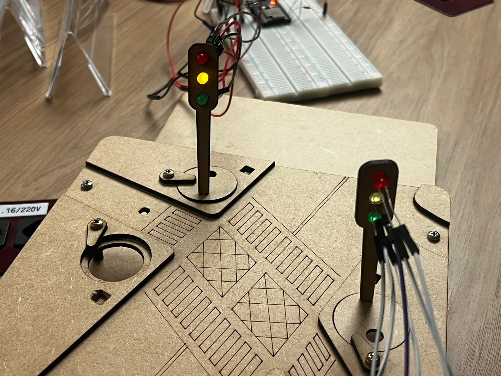
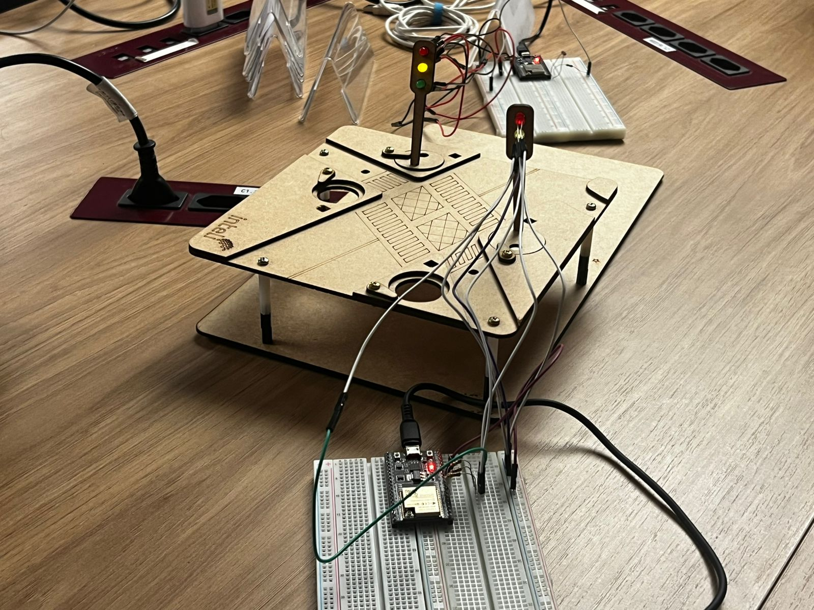
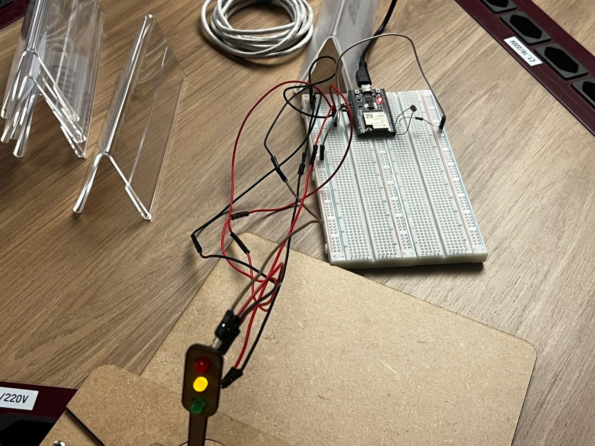
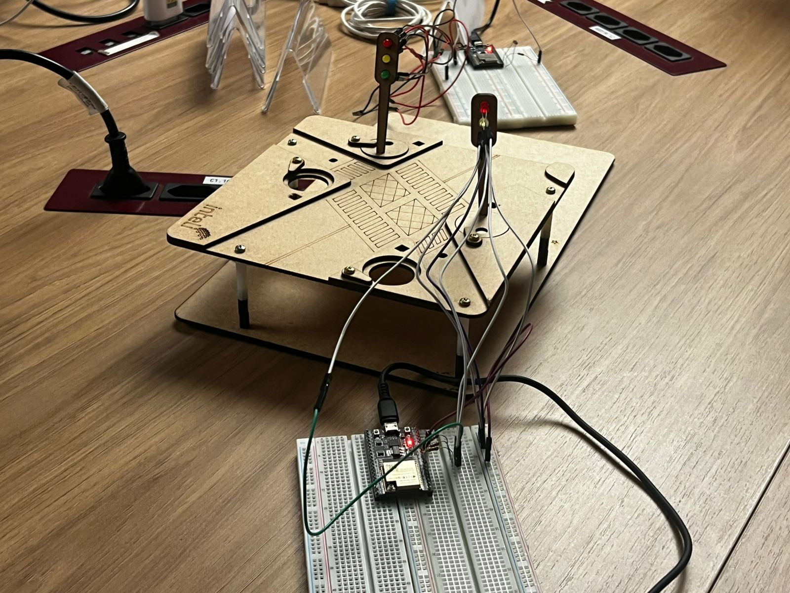
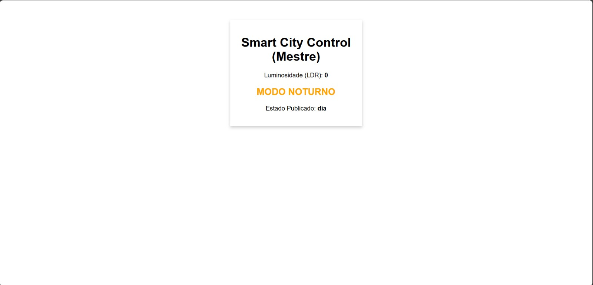

# Semáforo Inteligente - Smart City

## Introdução

Este projeto implementa um sistema de semáforos inteligentes que se comunicam entre si e se adaptam automaticamente às condições de luminosidade do ambiente. O sistema foi desenvolvido como parte de uma iniciativa de Smart City, onde os semáforos não apenas controlam o tráfego, mas também ajustam seu comportamento de forma autônoma para diferentes cenários, como o modo noturno.

O projeto utiliza dois microcontroladores ESP32 que controlam semáforos independentes, um sensor LDR (Light Dependent Resistor) para detecção de luminosidade, e comunicação via protocolo MQTT para sincronização entre os dispositivos. Além disso, oferece uma interface web acessível diretamente pelo ESP32, permitindo monitoramento em tempo real do sistema.

## Objetivos do Projeto

1. Detectar a presença de veículos através de variação de luz captada pelo sensor LDR
2. Implementar modo noturno automático quando a luminosidade ambiente cair abaixo de um limite estabelecido
3. Sincronizar dois semáforos para controle de tráfego em um cruzamento
4. Fornecer interface web para visualização dos dados do sistema em tempo real

## Componentes Utilizados

### Hardware

- 2x ESP32 DevKit
- 6x LEDs (2 verdes, 2 amarelos, 2 vermelhos)
- 1x Sensor LDR (Light Dependent Resistor)
- 6x Resistores de 220Ω (para LEDs)
- 1x Resistor de 10kΩ (para divisor de tensão do LDR)
- Protoboard e jumpers
- Fonte de alimentação USB

### Software

- Arduino IDE
- Biblioteca WiFi.h (nativa do ESP32)
- Biblioteca WebServer.h (nativa do ESP32)
- Biblioteca PubSubClient.h (para comunicação MQTT)

## Arquitetura do Sistema

O sistema é composto por dois ESP32 com funções distintas:

### ESP32 1 (semaforo_1.ino)

- Controla o Semáforo 1
- Realiza leitura do sensor LDR
- Determina se o sistema deve operar em modo noturno
- Publica o estado atual via MQTT
- Hospeda interface web para monitoramento

### ESP32 2 (semaforo_2.ino)

- Controla o Semáforo 2
- Inscreve-se no tópico MQTT
- Reage às mensagens publicadas pelo 1
- Sincroniza seu comportamento com o Semáforo 1

---

## Parte 1: Montagem Física e Programação com LDR e Modo Noturno

### Montagem do Circuito

#### Semáforo 1 (ESP32 1)

**Conexões dos LEDs:**

- LED Verde: GPIO 18
- LED Amarelo: GPIO 19
- LED Vermelho: GPIO 21

**Conexão do Sensor LDR:**

- Terminal 1 do LDR: 3.3V
- Terminal 2 do LDR: GPIO 34 (ADC1_CH6) + Resistor de 10kΩ para GND

O LDR forma um divisor de tensão com o resistor de 10kΩ. Quando a luminosidade aumenta, a resistência do LDR diminui, aumentando a tensão no pino analógico. Quando escurece, a resistência aumenta e a tensão diminui.



#### Semáforo 2 (ESP32 2)

**Conexões dos LEDs:**

- LED Verde: GPIO 25
- LED Amarelo: GPIO 26
- LED Vermelho: GPIO 27



### Funcionamento do Sensor LDR

O sensor LDR (Light Dependent Resistor) é um resistor cuja resistência varia de acordo com a intensidade luminosa incidente sobre ele. No projeto, ele é utilizado para:

1. **Detecção de Luminosidade Ambiente**: O ESP32 1 realiza leituras analógicas contínuas do sensor através do GPIO 34
2. **Ativação do Modo Noturno**: Quando o valor lido cai abaixo do limite configurado (400 por padrão), o sistema entra automaticamente em modo noturno
3. **Simulação de Tráfego**: Variações rápidas de luz podem simular a passagem de veículos, embora o sistema atual utilize o sensor principalmente para detecção de condições noturnas

#### Calibração do LDR

O valor de threshold para ativação do modo noturno está definido na linha 25 do código:

```cpp
int limiteLuz = 400;
```

Este valor deve ser ajustado conforme as condições de iluminação do ambiente. Para calibrar:

1. Conecte o ESP32 e abra o Monitor Serial (115200 baud)
2. Observe os valores de luminosidade exibidos na interface web
3. Teste em diferentes condições de luz (sala escura, luz ambiente, luz direta)
4. Ajuste o `limiteLuz` para um valor intermediário entre condições normais e escuras

### Lógica de Funcionamento

#### Modo Normal (Tráfego Diurno)

O sistema implementa um ciclo semafórico clássico com sincronização entre os dois semáforos:

**Semáforo 1:**

1. Verde: 5 segundos
2. Amarelo: 2 segundos
3. Vermelho: 7 segundos (tempo para o Semáforo 2 completar seu ciclo)

**Semáforo 2:**

- Permanece vermelho enquanto Semáforo 1 está verde ou amarelo
- Fica verde quando Semáforo 1 está vermelho
- Retorna ao vermelho quando Semáforo 1 volta ao verde



#### Modo Noturno

Quando o valor do LDR cai abaixo do limite estabelecido:

1. Ambos os semáforos entram em modo de segurança
2. O LED amarelo de cada semáforo pisca a cada 500ms
3. Os LEDs verde e vermelho permanecem apagados
4. O sistema publica o estado "noite" via MQTT



Veja o sistema completo em funcionamento no vídeo:


### Comunicação MQTT

O protocolo MQTT (Message Queuing Telemetry Transport) é utilizado para sincronizar os dois semáforos:

**Tópico:** `meu-semaforo-smart-city/estado`

**Mensagens Publicadas pelo ESP 1:**

- `s1_verde`: Semáforo 1 está verde
- `s1_amarelo`: Semáforo 1 está amarelo
- `s1_vermelho`: Semáforo 1 está vermelho
- `noite`: Sistema em modo noturno

O ESP32 2 inscreve-se neste tópico e reage às mensagens recebidas, ajustando o estado do Semáforo 2 de acordo.

---

## Parte 2: Configuração da Interface Online

### Interface Web Renderizada pelo ESP32

Uma das características mais interessantes do projeto é a interface web hospedada diretamente no ESP32 1. Diferentemente de aplicações web tradicionais que requerem um servidor externo, o ESP32 atua como um servidor HTTP completo, renderizando HTML diretamente em sua memória.

### Como Funciona o innerHTML no ESP32

#### Geração de HTML Dinâmico

O ESP32 utiliza a biblioteca `WebServer.h` para criar um servidor HTTP na porta 80. O código HTML é construído dinamicamente na função `handleRoot()` através de concatenação de strings:

```cpp
void handleRoot() {
  String html = "<!DOCTYPE html><html><head><meta charset='UTF-8'>";
  html += "<meta name='viewport' content='width=device-width, initial-scale=1'>";
  html += "<meta http-equiv='refresh' content='2'>"; // Atualiza a cada 2s
  html += "<style>body{font-family: Arial; text-align: center; margin-top: 50px;}";
  html += ".card{box-shadow: 0 4px 8px 0 rgba(0,0,0,0.2); padding: 20px; width: 300px; margin: auto;}";
  html += "</style></head><body>";

  html += "<div class='card'><h1>🚦 Smart City Control (Mestre)</h1>";
  html += "<p>Luminosidade (LDR): <strong>" + String(valorLDR) + "</strong></p>";

  if(modoNoturnoAtivo) {
    html += "<h2 style='color:orange;'>🌙 MODO NOTURNO</h2>";
  } else {
    html += "<h2 style='color:green;'>☀️ TRÁFEGO NORMAL</h2>";
  }

  html += "<p>Estado Publicado: <strong>" + estadoAtualParaPublicar + "</strong></p>";
  html += "</div></body></html>";

  server.send(200, "text/html", html);
}
```

#### Características da Interface

1. **HTML5 Válido**: O código gera um documento HTML completo com DOCTYPE, head e body
2. **Responsivo**: Utiliza meta viewport para adaptação em dispositivos móveis
3. **Auto-refresh**: Meta tag de refresh atualiza a página a cada 2 segundos automaticamente
4. **Estilização CSS Inline**: Estilos são incorporados diretamente no HTML para evitar requisições adicionais
5. **Dados Dinâmicos**: Valores de variáveis C++ são interpolados na string HTML usando concatenação

#### Fluxo de Renderização

1. Usuário acessa o IP do ESP32 pelo navegador
2. ESP32 recebe a requisição HTTP GET na rota "/"
3. Função `handleRoot()` é chamada
4. String HTML é montada com valores atuais das variáveis
5. ESP32 envia resposta HTTP 200 com content-type "text/html"
6. Navegador renderiza o HTML recebido
7. Após 2 segundos, página recarrega automaticamente (meta refresh)

### Recursos da Interface

A interface web exibe em tempo real:

- Valor atual de luminosidade lido pelo sensor LDR
- Estado operacional atual (Modo Noturno ou Tráfego Normal)
- Última mensagem publicada no tópico MQTT
- Interface responsiva e centralizada com card estilizado



### Acesso à Interface

Após a conexão do ESP32 1 à rede Wi-Fi, o endereço IP é exibido no Monitor Serial. A interface pode ser acessada digitando este IP em qualquer navegador conectado à mesma rede.

---

### Verificação do Funcionamento

1. **Monitor Serial**: Verifique se ambos os ESP32 conectaram ao Wi-Fi e ao broker MQTT
2. **Interface Web**: Acesse o IP do ESP32 1 no navegador
3. **Teste do LDR**: Cubra o sensor com a mão e observe a mudança para modo noturno
4. **Sincronização**: Observe se o Semáforo 2 reage corretamente aos estados do Semáforo 1

### Possíveis Problemas e Soluções

#### ESP32 não conecta ao Wi-Fi

- Verifique se as credenciais estão corretas
- Confirme que está usando uma rede 2.4GHz (ESP32 não suporta 5GHz)
- Tente reiniciar o roteador

#### MQTT não conecta

- Verifique se o broker está acessível
- Para broker local, confirme que o firewall não está bloqueando a porta 1883
- Teste a conectividade: `mosquitto_sub -h SEU_IP -t "teste"`

#### Modo noturno não ativa

- Ajuste o valor de `limiteLuz` no código
- Verifique a conexão do LDR
- Teste o LDR no Monitor Serial observando os valores lidos

#### Interface web não carrega

- Confirme o endereço IP no Monitor Serial
- Verifique se está na mesma rede que o ESP32
- Limpe o cache do navegador

---

## Estrutura do Projeto

```
semaforoOnline/
├── README.md                 # Esta documentação
├── .gitignore               # Arquivos ignorados pelo Git
├── src/
│   ├── semaforo_1.ino      # Código do ESP32 1 (com LDR)
│   └── semaforo_2.ino      # Código do ESP32 2
└── media/
    ├── 1.jpeg              # Montagem do Semáforo 1
    ├── 2.jpeg              # Montagem do Semáforo 2
    ├── 3.jpeg              # Sistema em modo normal
    ├── 4.jpeg              # Sistema em modo noturno
    ├── 5.jpeg              # Interface web
    └── 6.mp4               # Vídeo de demonstração
```

---

## Conceitos de Smart City Aplicados

Este projeto demonstra diversos conceitos fundamentais de cidades inteligentes:

1. **IoT (Internet of Things)**: Dispositivos conectados comunicando-se via rede
2. **Edge Computing**: Processamento de dados no próprio dispositivo (ESP32)
3. **Automação Inteligente**: Sistema adapta-se automaticamente às condições ambientais
4. **Comunicação M2M**: Máquinas (semáforos) comunicando entre si sem intervenção humana
5. **Monitoramento Remoto**: Interface web para visualização em tempo real
6. **Eficiência Energética**: Modo noturno reduz intensidade de operação quando não necessário

---

## Conclusão

Este projeto demonstra a aplicação prática de conceitos de IoT e Smart Cities através de um sistema de semáforos inteligentes. A integração de sensores, comunicação sem fio, processamento embarcado e interface web ilustra como tecnologias modernas podem ser aplicadas para melhorar a infraestrutura urbana.

O sistema implementado é escalável, modular e pode servir como base para projetos mais complexos de gerenciamento de tráfego urbano. A capacidade do ESP32 de atuar como servidor web, controlador de hardware e cliente MQTT simultaneamente demonstra o potencial dos microcontroladores modernos em aplicações de cidades inteligentes.

---
